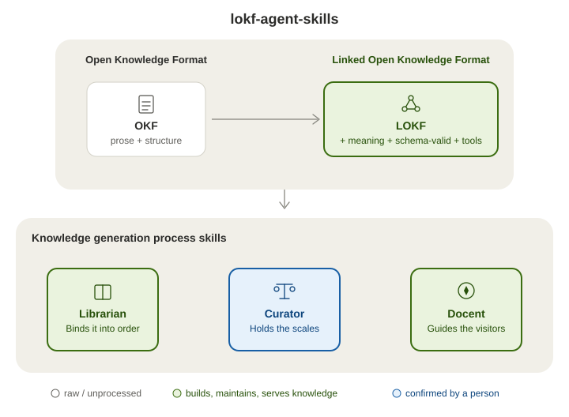

# LOKF Agent Skills

> "We lasso the world with networks of silver-coloured Italian hemp,\
> We bind down the world into some sort of order;\
> We balance the earth in a pair of scales of our own devising."\
> — Amy Lowell, *The Congressional Library* (1922)

Four [Agent Skills](https://agentskills.io/home) that turn a repository's scattered knowledge into a maintained, trusted asset using **[LOKF](https://lokf.nolan-nichols.com/)** (Linked Open Knowledge Format) - a semantic profile of OKF in which a plain folder of Markdown concept files carries enough meaning to be validated by schema, queried as a graph, and read by people and agents alike. The [lokf python](https://pypi.org/project/lokf) package provides schema and tooling. **An agent derives it. Deterministic tools check it. A named person vouches for it. The bundle records which of the three happened to every claim.**

<p align="center">
  
</p>

> **For AI agents:** if `.lokf/knowledge/index.md` exists in this repository,
> read it first - it is a queryable [LOKF](https://lokf.nolan-nichols.com)
> knowledge bundle of repository-specific context; `llms.txt` says how to weigh
> what you find there (drafts vs. person-confirmed) and names the `lokf-docent`
> skill for answering from it.

## Why libraries have catalogues

The knowledge already exists - in code, documents, diagrams, policies, operational records. What's missing is a layer that sits between those sources and whoever needs them next, and stays put. Without it, every task starts the same way: find the material, work out how it connects, judge what's still true. That's real work, and the collected context dies with the task - the next person, or next conversation with an assistant, pays for it again.

A bundle keeps that work instead of discarding it. But it is only worth keeping if you can tell what's sound - otherwise you re-verify everything yourself, the very thing you were trying to avoid, and the files quietly rot.

So ask a question and the answer tells you where it came from and how far it has been checked, in plain words - *confirmed by a person*, or *nobody has checked this yet*. Those labels are computed from the files on every read, never stored, so they cannot drift from what they describe: its deterministic against a unchanged bundle.

## Four roles, three lines of the poem

| Skill | Role | Runs |
| --- | --- | --- |
| [`lokf-scaffolding`](skills/lokf-scaffolding/SKILL.md) | **Lays the network.** Bootstraps a fresh `.lokf/` sidecar (tooling, docs, dummy skeleton) into a repository that doesn't have one, from bundled templates; repairs a broken scaffolding file. | once |
| [`lokf-librarian`](skills/lokf-librarian/SKILL.md) | **Binds it into order.** Scrapes the repository, derives concepts with their sources, classifies them, wires typed relationships, audits, and hands off for review. Like a real librarian it catalogues without vouching - it deals in *facts about the repository*, never in verdicts about truth. | often, including on a schedule |
| [`lokf-curator`](skills/lokf-curator/SKILL.md) | **Holds the scales.** A human curator's assistant. Shows what needs a person's look, puts the source next to the claim, and records the person's verdict - confirm, correct, retire, send back - in the bundle's own frontmatter. It deals in *judgments a person made*, never in facts it derived. | a little, regularly |
| [`lokf-docent`](skills/lokf-docent/SKILL.md) ([examples](EXAMPLES.md)) | **Guides the visitors** - the role the poem leaves implicit, because the library exists for them. Answers questions from the bundle first, says how far each concept used has been trusted, verifies exact values at the source, and when the bundle has no answer explores the repository and records the miss so it becomes the librarian's next task. Read-only on the bundle. | whenever anyone asks |

*Curator* here is the museum sense - the one who authenticates, weighs provenance, and decides what goes on display; not the data-management sense, which describes the librarian's job.

A *docent* is the museum's guide - the one who walks visitors through a collection and explains what they are seeing, without moving anything on the shelves. If it helps to place yourself: the librarian reports, the curator fact-checks and edits, the docent reads - and writes back with corrections.

On a fresh repository they run in that order: scaffolding once, then the librarian filling the bundle and marking everything it creates a draft, then the curator, where a person turns drafts into confirmed knowledge a few at a time. After that it stops being a sequence and becomes a loop - the librarian refreshes on a schedule, readers send back what the bundle missed, and the curator works through whatever that surfaces.

## Trust stays visible

Every concept carries its own trust record, and the curator reports it in plain words rather than ontology terms:

- **Confirmed by a person** - a named person checked it against its source.
- **Checked by automation only** - the librarian re-checked that the source still matches; no person has.
- **Nobody has checked this yet** - no check of any kind is recorded.
- **Still a draft**, **edited since a person last confirmed it**, **past its review date**, **retired** - and, for prioritising, how many other concepts rely on each one.

The number to watch is **confirmed by a person: n of N**, and it is meant to rise slowly - a handful of concepts in a sitting, cumulative and partial by design. A small, young bundle can reach fully-confirmed quickly; a large or fast-growing one never quite does, and the report says so instead of pretending.

## Install

**Install what you need - each skill stands alone.** Scaffolding plus the librarian is enough to see the idea: the bundle gets built, everything in it marked a draft. Add the curator once there is a bundle worth trusting; until then the librarian's pull requests keep pointing at it. Already have a healthy `.lokf/`? Skip scaffolding. The docent goes anywhere an agent only *reads* a bundle.

**GitHub CLI** ([`gh skill`](https://cli.github.com/manual/gh_skill_install), GitHub CLI v2.90.0+):

```bash
gh skill install noelmcloughlin/lokf-agent-skills lokf-scaffolding
gh skill install noelmcloughlin/lokf-agent-skills lokf-librarian
gh skill install noelmcloughlin/lokf-agent-skills lokf-curator
gh skill install noelmcloughlin/lokf-agent-skills lokf-docent
```

Append `@v0.9.0` to each to pin all four to the same release.

**Open Skills CLI** ([`npx skills`](https://github.com/vercel-labs/skills)):

```bash
npx skills add noelmcloughlin/lokf-agent-skills \
  --skill lokf-scaffolding \
  --skill lokf-librarian \
  --skill lokf-curator \
  --skill lokf-docent
```

## For the curious: how a claim gets checked, and where the vocabulary ends

The sections above are everything you need to decide whether to install these. What follows is the mechanics, for anyone who wants to know exactly what "confirmed by a person" is standing on - and what to do when a bundle outgrows the built-in vocabulary.

### Four levels of checking

Each proves less than its name suggests. Only the third yields a claim someone has agreed to stand behind.

| Check | Who, when | What it proves | What it can't |
| --- | --- | --- | --- |
| Schema-valid | the `lokf` toolkit on every change (`just lokf-validate`, and `just lokf-check-refs` for relation targets); `lokf validate` again as the CI gate on every `.lokf/**` pull request | the frontmatter is well-formed, the types and relations are ones the schema knows, and every typed relation points at a concept that exists | that anything in it is true |
| Source-consistent | `lokf-librarian` on every scheduled refresh - shown as *checked by automation only* | the concept still matches what its source says today | that the source is right, or that the concept says what the team means |
| Human-confirmed | a named person, through `lokf-curator` - shown as *confirmed by a person* | someone accountable read the source and agreed | that it stays true - which is what review dates are for |
| Proven in use | readers, through `lokf-docent`, which records misses and disagreements in `.lokf/feedback.md` | the bundle answered a real question - or didn't, and the gap became the librarian's next task | nothing further - this is the feedback loop that feeds the other three |

The schema-valid row also runs live, outside these skills and the CLI: [LOKF Enforcer](https://github.com/noelmcloughlin/obsidian-lokf-enforcer) is an Obsidian plugin that checks the same LOKF layer in the editor, as you write, for anyone maintaining a bundle in Obsidian. It's an optional companion, not a dependency in either direction - `lokf validate` remains the gate these skills rely on.

### When the vocabulary stops fitting

LOKF's vocabulary is deliberately small - 14 classes, ten typed relations - which is what keeps bundles portable. When concepts stop fitting those classes, typically in a deep or safety-critical domain (medicine, law, finance, safety engineering), the answer is a domain schema written in [LinkML](https://linkml.io) that extends LOKF's, not a looser bundle. The curator flags the drift; the team decides; the librarian applies it. What it costs (no new tooling), how to write one, and how to validate values it binds to an external ontology: [`lokf-curator/references/domain-schemas.md`](skills/lokf-curator/references/domain-schemas.md).

## Repository layout

```text
skills/
  lokf-scaffolding/     SKILL.md + references/ + templates/  (~2.5k tokens loaded on trigger)
  lokf-librarian/       SKILL.md + references/               (~6k tokens loaded on trigger)
  lokf-curator/         SKILL.md + references/               (~2k tokens loaded on trigger)
  lokf-docent/          SKILL.md + references/               (~1.4k tokens loaded on trigger)
.github/workflows/
  validate.yml          repository contract + Agent Skills spec + Markdown/link checks (every PR)
  publish.yml           maintainer-gated release (workflow_dispatch only)
scripts/
  validate-repository.sh   the checks validate.yml runs
  smoke-test-install.sh    installs all four skills into a throwaway consumer repo and asserts the result
```

Each `SKILL.md` is a lean router; anything not needed on every invocation lives in that skill's `references/` (loaded only when the router points to it) so the always-resident cost stays small. `lokf-scaffolding/templates/` holds the actual files it scaffolds - copied verbatim, never retyped inline.

## Versioning

All four skills ship from this repository under one semantic version - `vMAJOR.MINOR.PATCH`, released together, so pinning them to the same tag always gives you a set that agrees with itself. What each level means: [CONTRIBUTING.md](CONTRIBUTING.md#release-process).

See [CHANGELOG.md](CHANGELOG.md) for what changed in each release.

## Contributing

See [CONTRIBUTING.md](CONTRIBUTING.md). Security issues: see [SECURITY.md](SECURITY.md).

## Credits

- [Nolan Nichols](https://lokf.nolan-nichols.com/), creator of [LOKF](https://lokf.nolan-nichols.com/specification/) (Linked Open Knowledge Format) and its [toolkit](https://github.com/nicholsn/lokf).
- The [LinkML Community](https://linkml.io/), creators of [LinkML](https://linkml.io/linkml/), the schema language LOKF is written in.

## License

[Apache License 2.0](LICENSE).
